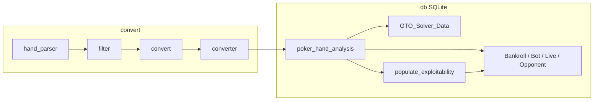

# Architecture — code-aligned

> **⚠ Legacy scope:** This document describes the **existing scripts** under `convert/` and `db/`. The new canonical project at `D:\Poker AI\poker_ai\` is described in [POKER_AI_BLUEPRINT.md](POKER_AI_BLUEPRINT.md); its phased build is in [ROADMAP.md](ROADMAP.md). The new project is **fully local** and uses **no external AI services** — every model is trained and served here.

## Repository layout (actual)

```
convert/
  filter.py          # D:\hand → D:\hand\2, strip CardRunners line, keep Hero won/lost
  convert.py         # D:\hand HTML hands → plain text (overwrite)
  converter.py       # d:\hand\4 → d:\hand\5 (positions, pot formatting)
  analizer.py        # Stats over D:\hand\hand_*.txt
  hand_parser.py     # Selenium: freepokertools.holdemmanager.com/hand/{id}/convert/

db/
  poker_hand_analysis.py   # Canonical ingest + Treys equity
  GTO_Solver_Data.py       # MCCFR+ helper + GTOSolverData + GTO_Solutions
  populate_exploitability.py
  Bankroll_Tracking.py
  Bot_Performance.py
  Live_Adjustments.py
  Opponent_Profiles.py

hand/              # Staged example histories (2…5) + csv/results.csv
drafts/            # Legacy GTO experiments (includes DynamicRanges draft)
validate_card_data.py
doc/               # This documentation
```

## End-to-end pipeline (as scripts expect it)

Intended **order** (paths must exist on your machine):

1. **Acquire** — `hand_parser.py` **or** copy `hand_*.txt` into your raw folder.
2. **Filter** — `filter.py`: raw → **`hand/2`** (or your `output_dir`).
3. **De-HTML** — `convert.py`: in-place on configured `hand_directory`.
4. **Position-normalize** — `converter.py`: **`hand/4` → `hand/5`**.
5. **Load DB** — `poker_hand_analysis.py`: reads **`d:/hand/5/`** (see `FOLDER_PATH`), writes **`d:/hand/db/poker.db`** (see `DB_PATH`).
6. **GTO rows** — `GTO_Solver_Data.py`: requires existing `Games`/`Players`/`Hands`/`Actions`; fills **`GTO_Solutions`** (drops that table first).
7. **Exploitability** — `populate_exploitability.py` after core tables populated.
8. **Downstream** — `Bankroll_Tracking.py`, `Bot_Performance.py`, `Live_Adjustments.py`, `Opponent_Profiles.py` (each expects prior tables; several **drop their own table** at start).



## Canonical SQLite schema (from `poker_hand_analysis.create_tables`)

| Table | Role |
|-------|------|
| `Games` | `hand_id`, stakes text, `game_type`, **`num_players`**, `small_blind`, `big_blind` |
| `Players` | Per hand: `player_id`, `position`, stacks, `is_hero` |
| `Hands` | Hero cards, concatenated board, pot per street |
| `Actions` | Street, `action_type`, amounts, pot before/after, eff stack, bet/pot |
| `Results` | Net, won pot, showdown, **street equities** + `final_equity` |

**Added by other scripts (non-exhaustive):** `GTO_Solutions`, `Exploitability`, `Bankroll_Tracking`, `Bot_Performance`, `Training_Metrics`, `Live_AI_Adjustments`, `Opponent_Profiles`.

## Parser contract (`poker_hand_analysis.parse_hand_file`)

- **Hand id** from filename `hand_(\d+).txt`.
- **First line:** stakes `$/...`, **`NLH`**, **`N Players`**.
- **Stack lines:** `Hero (MP):` or `SB:` style with `$` and `bb`.
- **Hero cards:** `Preflop` line with Treys-style **`Xs Xs`** tokens.
- **Streets:** `Flop:` / `Turn:` / `River:` with pot in parentheses and cards.

Hands in **`hand/5/`** match this contract after `converter.py`.

## `GTO_Solver_Data.py` at a glance

- **`MCCFRPlus`:** regret vectors (5 actions: fold/call/raise/bet/check), exploration decay, CFV from DB + Deuces strength.
- **`GTOSolverData`:** reads/writes **`GTO_Solutions`**; **`process_hand(hand_id)`** drives MCCFR iterations and persistence (see file for iteration counts and helpers).

This is **research / heuristic CFR**, not a full commercial solver abstraction.

## Universal instrument — target module boundaries

Not in the repo yet; recommended split:

| Module | Responsibility |
|--------|----------------|
| `config` | Paths, DB URL, player counts, feature flags |
| `ingest` | Parsers + future HM2 SQL adapters → row models (see [HAND_HISTORY_FORMATS.md](HAND_HISTORY_FORMATS.md)) |
| `store` | Migrations, no accidental `DROP` in normal runs |
| `features` | Encode table state for 6–10 seats |
| `policy` | Single decision API + profile hooks |
| `train` | Jobs, checkpoints, metrics |
| `apps/api` | **FastAPI** backend (recommended) |
| `apps/web` | **React + TypeScript + Vite** dashboard (see [DASHBOARD_AND_INTEGRATIONS.md](DASHBOARD_AND_INTEGRATIONS.md)) |

Until then, **`db/*.py` + `convert/*.py`** are the integration surface.
