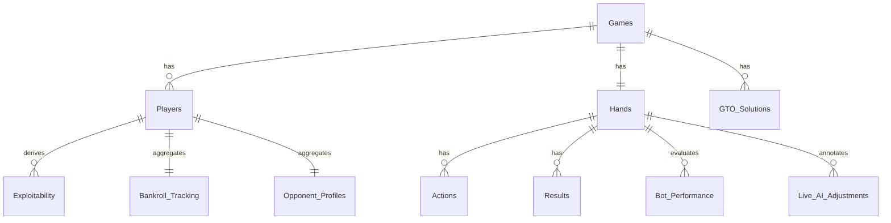

# Database schema — authoritative reference

This is the **single source of truth** for the SQLite schema *as it actually exists today* across all `db/*.py` scripts, plus the `DynamicRanges` table from `drafts/`. Use it when writing new ingest, queries, dashboards, or migrations.

> **Active product DB:** The **poker_ai** Phase 1 canonical store (SQLAlchemy models under `poker_ai/src/poker_ai/store/`, migrations `poker_ai/migrations/`, default `poker_ai/data/poker_ai.db`) is summarized in [ROADMAP.md](ROADMAP.md) — **Phase 1 — implementation snapshot**. This document still describes the **legacy** `db/` Python layout for historical reference. Legacy scripts defaulted to `d:/hand/db/poker.db` (Windows); replace via the unified config in [ROADMAP.md](ROADMAP.md) Phase 0.

### Canonical store — `results` equity columns (Phase 4 note)

Table `results` in `poker_ai/data/poker_ai.db` has `preflop_equity`, `flop_equity`, `turn_equity`, `river_equity`, `final_equity` (all nullable). **Ingest does not fill them today.** Phase 4 (`poker_ai.equity`) is the intended calculator for a future **enrich/backfill** job (vs-random and/or vs-range — product choice). Phase 4 optional cache is **parquet on disk**, not rows in SQLite.

**Phase W5 note:** The web **Equity** page (`POST /equity`) computes equity on demand but **does not write** these columns. Backfill remains a separate later task — see [PHASE4_EQUITY.md](../poker_ai/docs/PHASE4_EQUITY.md) “Out of scope / add later”.

---

## 1. Table-by-table reference

Tables are listed in the order an end-to-end run produces them.

### 1.1 `Games` — one row per hand
Created by `db/poker_hand_analysis.py::create_tables`.

| Column | Type | Notes |
|--------|------|-------|
| `hand_id` | INTEGER **PK** | Parsed from filename (`hand_(\d+)\.txt`). |
| `stakes` | TEXT | Stored as `"<sb>/<bb>"` (e.g. `"0.02/0.05"`). |
| `game_type` | TEXT | `"NLH"` if `"NLH"` is in line 1, else `"Other"`. |
| `num_players` | INTEGER | Parsed from `"<N> Players"` on line 1 (header). |
| `small_blind` | REAL | Float dollars. |
| `big_blind` | REAL | Float dollars. |

Common queries:

```sql
-- Players-per-hand histogram
SELECT num_players, COUNT(*) FROM Games GROUP BY num_players ORDER BY num_players;

-- Stakes distribution
SELECT stakes, COUNT(*) FROM Games GROUP BY stakes ORDER BY 2 DESC;
```

### 1.2 `Players` — per-hand seat snapshot
Created by `poker_hand_analysis.py`.

| Column | Type | Notes |
|--------|------|-------|
| `hand_id` | INTEGER | FK → `Games(hand_id)` |
| `player_id` | INTEGER | **Position-derived** counter, **resets every hand** to `1..num_players` (see “Pitfalls” below). |
| `position` | TEXT | `UTG`, `MP`, `CO`, `BTN`, `SB`, `BB`, …; `Unknown` on parse fallback. |
| `stack_size` | REAL | Dollars at deal. |
| `bb_size` | REAL | Stack expressed in big blinds. |
| `is_hero` | INTEGER | 0/1 boolean. |
| **PK** | (`hand_id`, `player_id`) | |

### 1.3 `Hands` — per-hand board / pots / hero cards

| Column | Type | Notes |
|--------|------|-------|
| `hand_id` | INTEGER **PK** | FK → `Games(hand_id)` |
| `hero_position` | TEXT | Mirrors `Players.position` where `is_hero=1`. |
| `hero_cards` | TEXT | Two Treys-style tokens space-separated, e.g. `"Ah Kd"`. |
| `board_cards` | TEXT | Up to 5 tokens space-separated (concatenation of flop+turn+river). |
| `pot_preflop` | REAL | Always 0 today (pot before the flop is not parsed back into preflop slot). |
| `pot_flop` | REAL | From `Flop: ($X)` line. |
| `pot_turn` | REAL | From `Turn: ($X)` line. |
| `pot_river` | REAL | From `River: ($X)` line. |

### 1.4 `Actions` — granular line of play

| Column | Type | Notes |
|--------|------|-------|
| `action_id` | INTEGER **PK AUTOINCREMENT** | Stable order key. |
| `hand_id` | INTEGER | FK → `Hands(hand_id)` |
| `player_id` | INTEGER | Joins to `Players` by (`hand_id`,`player_id`). |
| `position` | TEXT | Snapshot at action time; `"Unknown"` if parser couldn't resolve. |
| `street` | TEXT | `"Preflop"`, `"Flop"`, `"Turn"`, `"River"` — **mixed-case**. |
| `action_type` | TEXT | `"Fold"`, `"Call"`, `"Raise"`, `"Bet"`, `"Check"` — **mixed-case** in this table; some downstream queries lowercase it (potential casing bug, see Pitfalls). |
| `amount` | REAL | Raise-to / call / bet amount in dollars; 0 for folds/checks. |
| `is_all_in` | INTEGER | 1 if `"all-in"` substring present in raw line. |
| `effective_stack` | REAL | Snapshot of acting player's `stack_size` at the time of the action (not corrected for chips already in pot). |
| `pot_before` | REAL | Running pot **before** this action. |
| `pot_after` | REAL | Running pot **after** this action. |
| `bet_to_pot_ratio` | REAL | For bets / raises only — `(amount - last_bet)/pot_before`; NULL otherwise. |

### 1.5 `Results` — per (hand, player) outcome + equity

| Column | Type | Notes |
|--------|------|-------|
| `hand_id` | INTEGER | FK → `Hands` |
| `player_id` | INTEGER | |
| `position` | TEXT | |
| `cards` | TEXT | Empty unless player showed at showdown. |
| `net_result` | REAL | Signed dollars (negative if lost). |
| `won_pot` | REAL | Gross winnings. |
| `showdown` | INTEGER | 1 if showed/won at showdown, else 0. |
| `final_equity` | REAL | River equity (Treys MC). |
| `preflop_equity` | REAL | Treys MC (no board). |
| `flop_equity` | REAL | Treys MC after flop. |
| `turn_equity` | REAL | Treys MC after turn. |
| `river_equity` | REAL | Treys MC after river. |
| **PK** | (`hand_id`, `player_id`) | |

> **Equity is hero-anchored:** `calculate_equity_monte_carlo` only seeds known cards for the player whose `hero_cards` is set on the parsed dict; opponent cards are randomized. River equity collapses to {0,1} once 5 board cards are dealt and the hero hand is determined — see `pot_preflop` quirk below for analogous logic.

---

## 2. Tables created by other modules

### 2.1 `GTO_Solutions` — `db/GTO_Solver_Data.py`

| Column | Type | Notes |
|--------|------|-------|
| `hand_id` | INTEGER | |
| `player_id` | INTEGER | |
| `position` | TEXT | |
| `street` | TEXT | Lowercased here (`"preflop"`, `"flop"`, …). |
| `action` | TEXT | Per-action row — `fold/call/raise/bet/check`. |
| `frequency` | REAL or JSON | Stored as `json.dumps(action_frequency_dict)`. |
| `expected_value` | REAL or JSON | `calculate_ev` returns a per-street dict; the script writes the dict, not a float — **column type drift**. |
| `optimal_range` | TEXT | `json.dumps(list_of_strings)`. |
| `nash_equilibrium` | TEXT | `json.dumps(strategy_dict)`. |
| `poker_matrix` | TEXT | `json.dumps(action_dict)`. |
| `current_strategy` | TEXT | `json.dumps(strategy_dict)`. |
| `recommended_action` | TEXT | One of `fold/call/raise/bet/check`. |
| **PK** | (`hand_id`, `player_id`, `street`, `action`) | |

> The script **drops** only `GTO_Solutions` on startup (not the rest of the DB). Multiple JSON-blob columns make this table effective for inspection but inefficient for SQL filters — fixing this is part of [ROADMAP.md](ROADMAP.md) Phase 1.

### 2.2 `Exploitability` — `db/populate_exploitability.py`

| Column | Type | Notes |
|--------|------|-------|
| `player_id` | INTEGER | Per-hand row, despite the name. |
| `hand_id` | INTEGER | FK → `Hands` |
| `position` | TEXT | |
| `vpip` | REAL | **Caveat:** computed as `Raise+Call+Bet / all_actions` across all streets, not the standard preflop-only definition. |
| `pfr` | REAL | `Raise & street='Preflop' / all_actions`. |
| `aggression_factor` | REAL | `(Raise+Bet) / Call`, NULL-safe. |
| `cbet_flop`, `cbet_turn`, `cbet_river` | REAL | `Bet on street / actions on street`. |
| `fold_to_cbet` | REAL | `Folds on Flop/Turn/River / actions on those streets` (proxy, not strict cbet response). |
| `showdown_win` | REAL | `won_pot>0 / showdowns`. |
| `three_bet_rate` | REAL | `Raise & Preflop & position in (SB,BB) / Preflop actions in (SB,BB)`. |
| `steal_attempt_rate` | REAL | `Raise & Preflop & position in (BTN,CO) / Preflop actions in (BTN,CO)`. |
| `exploitability_score` | REAL | NN regression output (see [SELF_LEARNING_AND_RESEARCH.md](SELF_LEARNING_AND_RESEARCH.md)). |
| `playstyle` | TEXT | One of `TAG / Semi-TAG / Weak-Tight / Nit / LAG / Loose-Passive / Maniac / Whale`. |
| `opponent_tendency` | TEXT | One of `Ultra-Tight / Tight-Passive / Tight-Aggressive / Semi-Tight / Balanced / Aggressive / Loose-Passive / Loose-Aggressive / Maniac`. |
| **PK** | (`player_id`, `hand_id`) | |

See [POKER_METRICS_GLOSSARY.md](POKER_METRICS_GLOSSARY.md) for industry-standard formulas and how the repo's diverge.

### 2.3 `Bankroll_Tracking` — `db/Bankroll_Tracking.py`

| Column | Type |
|--------|------|
| `player_id` | INTEGER **PK** |
| `starting_balance` | REAL |
| `ending_balance` | REAL |
| `net_profit_loss` | REAL |
| `total_hands` | INTEGER |
| `bb_per_100_hands` | REAL |
| `total_rake_paid` | REAL |
| `timestamp` | DATETIME (`CURRENT_TIMESTAMP`) |

> **Pitfall:** `player_id` is **not unique across hands** (the parser re-uses 1..N each hand). The current PK collapses every hand's hero into a single row — fine for the *hero* (filtered by `is_hero=1`), wrong if you ever extend it to non-heroes. See Pitfalls §4.

### 2.4 `Bot_Performance` + `Training_Metrics` — `db/Bot_Performance.py`

| `Bot_Performance` column | Type |
|---|---|
| `session_id` | INTEGER **PK AUTOINCREMENT** |
| `hand_id` | INTEGER FK |
| `player_id` | INTEGER |
| `decision_quality` | TEXT (`Optimal/Suboptimal/Blunder`) |
| `expected_value` | REAL |
| `actual_result` | REAL |
| `deviation_from_GTO` | REAL |
| `exploitability_gain` | REAL |
| `adjustment_made` | TEXT (`Yes/No`) |
| `timestamp` | DATETIME |

| `Training_Metrics` column | Type |
|---|---|
| `episode` | INTEGER **PK** |
| `avg_reward` | REAL |
| `avg_regret` | REAL |
| `timestamp` | DATETIME |

### 2.5 `Live_AI_Adjustments` — `db/Live_Adjustments.py`

| Column | Type |
|--------|------|
| `session_id` | INTEGER **PK AUTOINCREMENT** |
| `hand_id` | INTEGER FK |
| `player_id` | INTEGER |
| `current_strategy` | TEXT (`GTO/Exploitative/Hybrid` — sourced from `GTO_Solutions.current_strategy`) |
| `recommended_action` | TEXT |
| `adjustment_reason` | TEXT |
| `opponent_tendency` | TEXT (mirrors `Exploitability.playstyle`) |
| `new_bet_size` | REAL |
| `new_frequency` | REAL |
| `timestamp` | DATETIME |

### 2.6 `Opponent_Profiles` — `db/Opponent_Profiles.py`

| Column | Type |
|--------|------|
| `player_id` | INTEGER **PK** |
| `total_hands` | INTEGER |
| `avg_vpip` | REAL |
| `avg_pfr` | REAL |
| `avg_agg_factor` | REAL |
| `avg_cbet` | REAL |
| `avg_fold_to_cbet` | REAL |
| `avg_showdown_win` | REAL |
| `playstyle` | TEXT |
| `exploitability_index` | REAL |
| `last_seen` | DATETIME |

> Same `player_id` cross-hand-collision pitfall as `Bankroll_Tracking`.

### 2.7 `DynamicRanges` — only in `drafts/GTO_Solver_Data_1.py`

| Column | Type |
|--------|------|
| `position` | TEXT **PK** |
| `range` | TEXT (`"AA,KK,…"`) |

Not used by the canonical `db/GTO_Solver_Data.py`. Kept here because legacy queries may still reference it.

---

## 3. Foreign-key & dependency map



> SQLite enforces FKs only when `PRAGMA foreign_keys = ON;` is set per connection. Today no script sets this PRAGMA, so the FKs are **declarative documentation** only. Phase 1 of the roadmap should enable the PRAGMA in a shared connection helper.

---

## 4. Pitfalls observed in code

1. **Per-hand player IDs.** `parse_hand_file` reseeds `player_id_counter = 1` for every file. Aggregations grouping by `player_id` alone (e.g. `Bankroll_Tracking`, `Opponent_Profiles`) treat *every hand's* player 3 as the same person. This is OK for hero-only stats (`WHERE is_hero=1`) but invalid for opponent rollups. **Fix path:** add a global `player_uid` derived from a stable hash of nickname (text input) before normalization, or carry `(hand_id, player_id)` everywhere.
2. **Case-sensitive `action_type`.** `Actions.action_type` is title-case (`Raise`, `Fold`, …). `GTO_Solver_Data.py::_calculate_counterfactual_value` filters with `action_type = 'fold'` (lowercase). On SQLite the default text comparison **is case-sensitive**, so that filter currently returns 0 rows and the `opponent_fold_frequency` falls back to `0.2`. **Fix path:** standardize casing on insert, or use `LOWER(action_type) = ...`.
3. **`pot_preflop` always 0.** The parser tracks pot growth across actions but never writes the running pot back to `pot_preflop` after preflop completes. Use `MAX(pot_after) WHERE street='Preflop'` from `Actions` if you need it.
4. **Multiple silent `DROP TABLE`s.** `populate_exploitability.py`, `Bankroll_Tracking.py`, `Live_Adjustments.py`, `Opponent_Profiles.py`, `Bot_Performance.py` all drop *their* table at module import time. Importing one of these into a notebook will wipe data. See [ROADMAP.md](ROADMAP.md) Phase 1.
5. **Equity 0/1 collapse.** `update_equities_in_db` writes `river_equity` into both `final_equity` and `river_equity`. Once the board is complete the Treys evaluator is deterministic, so MC produces 1.0 for the best hand and 0.0 for everyone else — preserve a probabilistic *vs-range* equity if you want pre-showdown river decisions.
6. **JSON in `expected_value`.** `process_hand` passes `self.calculate_ev(...).get(...)` (a float), but the schema docs in this file mark the column REAL — except the column is declared as plain `REAL` and the script *also* sometimes writes a dict via `json.dumps` upstream. Add a check constraint or split into a `EVByStreet` table.

---

## 5. Recommended indexes

None of these exist today; they pay off as soon as the DB grows past ~5 k hands.

```sql
CREATE INDEX IF NOT EXISTS ix_actions_hand_street      ON Actions(hand_id, street);
CREATE INDEX IF NOT EXISTS ix_actions_player_street    ON Actions(player_id, street);
CREATE INDEX IF NOT EXISTS ix_results_hand             ON Results(hand_id);
CREATE INDEX IF NOT EXISTS ix_players_is_hero          ON Players(is_hero);
CREATE INDEX IF NOT EXISTS ix_gto_hand_street          ON GTO_Solutions(hand_id, street);
CREATE INDEX IF NOT EXISTS ix_exploitability_player    ON Exploitability(player_id);
CREATE INDEX IF NOT EXISTS ix_exploitability_playstyle ON Exploitability(playstyle);
```

Combine with `ANALYZE;` after large inserts so the SQLite query planner uses them.

---

## 6. Query cookbook

```sql
-- Hero win rate in BB/100 by position
SELECT p.position,
       COUNT(*)                                   AS hands,
       ROUND(SUM(r.net_result) / NULLIF(g.big_blind,0), 4) AS bb_won,
       ROUND(SUM(r.net_result) / NULLIF(g.big_blind,0)
             * 100.0 / COUNT(*), 4)               AS bb_per_100
FROM Players  p
JOIN Results  r ON r.hand_id = p.hand_id AND r.player_id = p.player_id
JOIN Games    g ON g.hand_id = p.hand_id
WHERE p.is_hero = 1
GROUP BY p.position
ORDER BY bb_per_100 DESC;

-- Seat-counts the parser saw vs num_players header
SELECT g.hand_id, g.num_players,
       (SELECT COUNT(*) FROM Players p WHERE p.hand_id = g.hand_id) AS seats_seen
FROM Games g
WHERE g.num_players != (SELECT COUNT(*) FROM Players p WHERE p.hand_id = g.hand_id);

-- Distribution of GTO recommended actions per street
SELECT street, recommended_action, COUNT(*)
FROM GTO_Solutions
GROUP BY street, recommended_action
ORDER BY street, COUNT(*) DESC;

-- Show all hands where the case-sensitivity bug hits the fold-frequency proxy
SELECT DISTINCT hand_id
FROM Actions
WHERE action_type IN ('Fold','Raise','Call','Bet','Check')
  AND action_type != LOWER(action_type);
```

---

## 7. Migration target — versioned, append-only

For Phase 1 of [ROADMAP.md](ROADMAP.md):

1. **Add a `_schema_meta` table** (`version INTEGER`, `applied_at DATETIME`).
2. **Bake all `CREATE TABLE` statements above into `migrations/0001_init.sql`** and have every script call a shared `apply_migrations()` helper.
3. **Replace silent `DROP`s** with explicit `--reset` flags or store “derived” tables in their own attached database (`ATTACH DATABASE 'derived.db' AS derived;`) so re-running analytics never touches raw ingest.
4. **Enable** `PRAGMA foreign_keys = ON;` and `PRAGMA journal_mode = WAL;` (see [PERFORMANCE_AND_SCALING.md](PERFORMANCE_AND_SCALING.md)).
5. **Globalize player identity** by adding a `Players_Global(player_uid TEXT PK, first_seen, alias)` table and linking via `Players.player_uid`.

---

## 8. Quick reference — table → owning script

| Table | Created in |
|-------|------------|
| `Games`, `Players`, `Hands`, `Actions`, `Results` | `db/poker_hand_analysis.py` |
| `GTO_Solutions` | `db/GTO_Solver_Data.py` |
| `Exploitability` | `db/populate_exploitability.py` |
| `Bankroll_Tracking` | `db/Bankroll_Tracking.py` |
| `Bot_Performance`, `Training_Metrics` | `db/Bot_Performance.py` |
| `Live_AI_Adjustments` | `db/Live_Adjustments.py` |
| `Opponent_Profiles` | `db/Opponent_Profiles.py` |
| `DynamicRanges` | `drafts/GTO_Solver_Data_1.py` (legacy) |

See also: [ARCHITECTURE.md](ARCHITECTURE.md) · [POKER_METRICS_GLOSSARY.md](POKER_METRICS_GLOSSARY.md) · [PERFORMANCE_AND_SCALING.md](PERFORMANCE_AND_SCALING.md).
