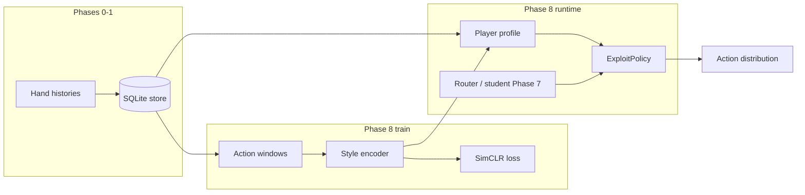

# Phase 8 — Opponent modelling + style embeddings

**Status:** Implemented (encoder, contrastive train, exploit policy, CLI, tests).  
**Roadmap:** [doc/ROADMAP.md](../../doc/ROADMAP.md) § Phase 8 · **Theory:** [doc/NOVEL_TECHNIQUES.md](../../doc/NOVEL_TECHNIQUES.md) § Style embeddings

---

## Why Phase 8 exists

Phases 0–7 give you a **strong population / GTO-ish policy** (CFR preflop, TexasSolver-distilled student, HHFormer context, HU vs multi-way router). That answers: *“What is a good default action in this spot?”*

Real poker profit comes from answering: *“What is a good action against **this** opponent?”*

| Approach | Limitation |
|----------|------------|
| Single GTO policy for everyone | Loses EV vs fish; over-bluffs vs nits |
| Hand-tuned rules per villain | Brittle, does not scale to thousands of players |
| VPIP / PFR / AF only | Low-dimensional, noisy, no smooth interpolation |

Phase 8 adds a **learned 64-dim opponent embedding** (like user vectors in recommender systems) and an **exploit policy** that conditions the Phase 7 stack on those vectors — without replacing the solver-backed brain.

---

## Deliverables (full list)

| # | Artifact | Role |
|---|----------|------|
| 1 | `models/style_encoder.py` | Small transformer: `(player_uid slot, last N action tokens)` → L2-normalized 64-d vector |
| 2 | `learn/style_dataset.py` | Sliding action windows per `player_uid`; augmentations for SimCLR |
| 3 | `learn/style_contrastive.py` | NT-Xent (SimCLR) training, kNN retrieval metric, saves `artifacts/style_encoder/v1/` |
| 4 | `opponents/metrics.py` | Canonical **hand-anchored** VPIP / PFR / AF ([POKER_METRICS_GLOSSARY](../../doc/POKER_METRICS_GLOSSARY.md)) |
| 5 | `opponents/profile.py` | Profile report: style vector + kNN neighbours + classical stats |
| 6 | `opponents/eval.py` | AIVAT HU eval: exploit vs GTO vs TAG / call-station / maniac |
| 7 | `policy/exploit_policy.py` | Wraps `load_best_policy()`; cross-attention state → opponent styles; conservative blend |
| 8 | `apps/cli` | `train style`, `opponents profile`, `opponents eval-exploit` |
| 9 | `tests/test_style_phase8.py` | Encoder shape, kNN gate, exploit smoke |
| 10 | `config/settings.py` | `POKER_AI_STYLE_ENCODER_ARTIFACT_DIR` |

**Integration hooks (Phases 0–7)**

- **Phase 1:** `player_uid` from HMAC (stable if nickname known; per-hand if anonymous).
- **Phase 3:** `pack_action_token` — same action encoding as sequence features.
- **Phase 5:** HHFormer tokenizer family (action vocab compatible).
- **Phase 7:** `load_best_policy()` / `RouterPolicy` as exploit **baseline** (GTO anchor).
- **Phase 9:** `Policy.propose(..., opponent_styles=...)`; `league/sim.py` passes per-seat style dicts.

---

## Architecture (conceptual)



**Clever bits**

1. **Contrastive learning** — same player, different time windows → close in embedding space; different players → far. Generalizes better than clustering on VPIP alone.
2. **Dense interpolation** — embeddings vary smoothly; you can kNN “players like this whale” for analysis and league targeting.
3. **GTO + exploit, not GTO replacement** — exploit **reweights** the Phase 7 distribution (`deviation_strength` blend), so you keep solver distillation as the anchor.
4. **Cross-attention** — current state (SPR, street, texture from Phase 7 extras) attends over opponent style vectors → context-dependent exploitation.
5. **Dual signals** — classical stats (auditable) + neural style (rich); dashboard-ready in Phase 10.

---

## Commands

```powershell
cd poker_ai
.venv\Scripts\Activate.ps1

# 1) Train (needs ingested DB; HU nicknames work best)
python -m poker_ai train style --epochs 40 --device auto

# 2) Profile a player (HU example UIDs from your DB)
python -m poker_ai opponents profile <player_uid> --weights artifacts/style_encoder/v1

# 3) Exit eval — Phase 7 baseline by default
python -m poker_ai opponents eval-exploit --hands 2000 --seed 42

# Heuristic-only baseline (debug compare)
python -m poker_ai opponents eval-exploit --baseline heuristic --hands 2000
```

**Find `player_uid` (HU, stable names):**

```powershell
python -c "import sqlite3; c=sqlite3.connect('data/poker_ai.db');
[print(r) for r in c.execute('''
  SELECT player_uid, COUNT(DISTINCT hand_id), MAX(screen_name)
  FROM players p JOIN games g ON g.hand_id=p.hand_id
  WHERE g.num_players=2 GROUP BY player_uid ORDER BY 2 DESC LIMIT 5
''')]"
```

---

## Exit criteria

| Criterion | Target | Your run (example) |
|-----------|--------|---------------------|
| kNN top-5 (held-out windows, train index) | > 0.6 | **1.0** in `artifacts/style_encoder/v1/metrics.json` (HU corpus, 2 val players) |
| Exploit vs GTO, AIVAT BB/100 vs TAG + station + maniac | mean ≥ +5 | Run `eval-exploit` with `--baseline best`; tune `--strength` |

**Notes on your results**

- **HU profiles (HyperboreanNL-BR / BluffBot4):** ~67–71% VPIP, ~44–49% PFR — LAG bots; kNN neighbours correctly cross-link each other (sim ~0.27–0.39).
- **6-max ephemeral uid:** 1 hand → useless profile until ingest has nicknames (OHH / PokerStars).
- **eval-exploit:** Uses seat alternation and `load_best_policy()` by default after this doc’s update; lower `--strength` if exploit overshoots vs station/TAG.

---

## Artifacts

```
artifacts/style_encoder/v1/
  style_encoder.safetensors
  metrics.json      # knn_top5_acc, train/val windows, wall time
  config.json
```

---

## Tests

```powershell
python -m pytest tests/test_style_phase8.py -q
```

---

## What comes next (Phase 9+)

- **League:** `main_exploiter` slot uses `ExploitPolicy` with live style vectors updated per session.
- **Phase 10 dashboard:** Player Profiles page plots VPIP/PFR/AF + 2D PCA of style embeddings.
- **Phase 11:** BOCPD on action streams; style vector drift as regime-change signal.
- **Phase 13 #5:** Bayesian range belief conditioned on style embedding.

---

## Professional design principles

1. **Do not fork the brain** — one GTO stack; exploitation is a conditioned residual.
2. **Auditable + learned** — stats for humans, embeddings for the policy.
3. **Local-first** — train and serve on your SQLite corpus; no external player API.
4. **Idempotent ingest** — same windows reproducible for retrain / continual learning (Phase 11).

This is what makes the stack closer to modern recommender / multi-agent systems than a static chart bot — while staying tied to the solver-distilled core you built in Phases 6–7.
