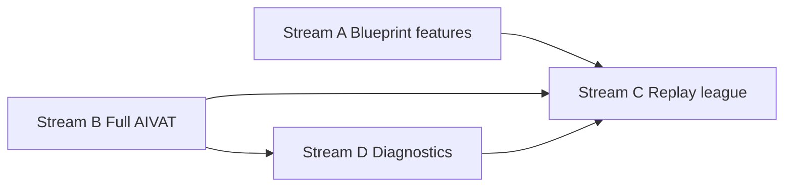

# v2 implementation guide — blueprint, AIVAT, DB replay league, diagnostics parity

> **Audience:** builders shipping **v2** after v1 sign-off (Phases 0–12, W0–W10 complete).  
> **Status:** **v2 Streams A–D shipped June 2026** (CLI + web).  
> **Principle:** every v2 capability ships **two ways** — **web** for non-technical users, **CLI** for technical users — on the **same** Python modules, DB, and artifacts.

**Parent:** [doc/ROADMAP.md §v2 backlog](../../doc/ROADMAP.md#v2-backlog--next-version-todo) · **v1 parity:** [CLI_WEB_PARITY.md](CLI_WEB_PARITY.md)

**Last updated:** June 2026

---

## How to read this doc

Each work stream has the same skeleton:

| Section | Purpose |
|---------|---------|
| **Goal** | One sentence |
| **v1 today** | What already ships |
| **Deliverables** | Code + artifacts |
| **CLI** | Typer commands + verify scripts |
| **Web** | Pages, jobs, API routes |
| **Exit criteria** | Checklist before marking v2 done |
| **Implementation order** | Suggested PR sequence |

**Shared pattern (copy from v1):**

1. Implement core logic in `poker_ai/src/poker_ai/…`
2. Wire **CLI** in `poker_ai/src/poker_ai/apps/cli/main.py`
3. Add **job** handler in `apps/api/services/job_runner.py` + `JOB_TYPES`
4. Add **web task card** in `apps/web/src/lib/pipelineTasks.ts` + labels in `jobLabels.ts`
5. Add **friendly summaries** in `apps/api/services/job_friendly.py`
6. Add **verify script** under `poker_ai/scripts/` or `apps/api/scripts/`
7. Update [CLI_WEB_PARITY.md](CLI_WEB_PARITY.md) and this doc

---

## Work stream A — Full blueprint feature set (Phase 3 extension)

### Goal

Ship the **remaining encoders and training inputs** from [POKER_AI_BLUEPRINT.md](../../doc/POKER_AI_BLUEPRINT.md) §2.4 and §2.7 so HHFormer, students, drift, and league all consume a **single versioned feature snapshot**.

### v1 today

| Module | Status |
|--------|--------|
| `features/info_set.py` | Shipped — CFR-stable keys |
| `features/board_texture.py` | Shipped — 16-dim embedding |
| `features/range.py` | Shipped — 1326-combo vectors |
| `features/sequence.py` + `hhformer_tokens.py` | Shipped — HHFormer JSONL path |
| `features/build.py` + `parallel.py` | Shipped — `features.jsonl` job |
| `models/value_net`, `decision_quality_head` | **Shipped** — train commands + web jobs + `/status` rows |
| `eval/` package (standalone) | **Shipped** — `eval/aivat.py`; league delegates when `POKER_AI_AIVAT_FULL=1` |
| DuckDB / Parquet feature snapshots | **Shipped** — `export_parquet.py` + `features_export_parquet` job |

### v2 deliverables

```
poker_ai/src/poker_ai/features/
├── blueprint_schema.py      # NEW — documents tensor names, shapes, dtypes (source of truth)
├── export_parquet.py        # NEW — features.jsonl → data/processed/v<date>/*.parquet
├── student_extras.py        # NEW — board texture + SPR + pot odds bundle for student rows
└── (extend) build.py        # --blueprint-full flag writes extended JSONL columns

poker_ai/src/poker_ai/models/
├── value_net.py               # NEW — DeepStack-lite value head (blueprint)
└── decision_quality_head.py   # NEW — hero decision audit vs GTO teacher

poker_ai/artifacts/features/
└── v2/
    ├── FEATURE_MANIFEST.json  # git_sha, dataset_hash, column list
    └── MODEL_CARD.md
```

### CLI (technical)

| Command | Purpose |
|---------|---------|
| `poker_ai features build --blueprint-full` | Extended JSONL (all blueprint columns) |
| `poker_ai features export-parquet --since YYYY-MM-DD` | Parquet snapshot for analytics / DuckDB |
| `poker_ai features validate-blueprint` | Round-trip + schema gate (new verify script) |
| `poker_ai train value-net` | Train value head on solver cache rows |
| `poker_ai train decision-quality` | Train audit head on logged hero spots |

**Verify:**

```powershell
cd "D:\Poker AI\poker_ai"
.\.venv\Scripts\python.exe scripts\verify_v2_blueprint_features.py
# Expect: schema OK, 19k hands encode <5ms, parquet row count == DB hands
```

### Web (non-technical)

| Surface | User action |
|---------|-------------|
| **Setup** → optional step **“Validate feature schema”** | One-click `features_validate_blueprint` |
| **Jobs** → **Validate feature schema** | Same as CLI `features validate-blueprint` |
| **Jobs** → **Export feature snapshot** | Runs `features_export_parquet` job |
| **Status** | Row “Blueprint features v2” green when manifest exists |
| **Models** (optional) | Cards for Value net / Decision quality when trained |

**API / jobs to add:**

- `features_build` — extend params: `blueprint_full: bool`
- `features_validate_blueprint` — new job type
- `train_value_net`, `train_decision_quality` — new job types

### Exit criteria

- [x] `FEATURE_MANIFEST.json` lists every column in `blueprint_schema.py`
- [x] `features validate-blueprint` passes on full `hand/6` corpus (`verify_v2_blueprint_features.py`)
- [x] HHFormer + student jobs can read extended columns without code forks
- [x] Web **Jobs** card runs same job as CLI (params mirrored in `pipelineTasks.ts`)
- [ ] Drift reports include ≥3 blueprint tensor distributions (KS/PSI) — **future observability**

### Suggested PR order

1. `blueprint_schema.py` + tests + `verify_v2_blueprint_features.py`
2. Extend `features/build.py` + CLI flag + web job param
3. Parquet export + Setup/Jobs card
4. Value net + decision quality head (models + train commands + optional web cards)

---

## Work stream B — Full AIVAT theory (Phase 9 / observability)

### Goal

Replace the v1 **showdown-luck sketch** in `league/evaluator.py` with **chance + strategy corrections** per [OBSERVABILITY.md](../../doc/OBSERVABILITY.md) §4 (Burch et al., 2018).

### v1 today

```python
# league/evaluator.py — _aivat_adjusted_delta()
# Removes ~25% BB luck at showdown only; no chance-tree or strategy correction.
```

Promotion gate uses `aivat_one_sample_pvalue()` on these adjusted samples — **works for v1** but is not full AIVAT.

### v2 deliverables

```
poker_ai/src/poker_ai/eval/           # NEW package (blueprint §1 layout)
├── __init__.py
├── aivat.py                            # chance + strategy corrections
├── baseline.py                         # equity / zero baseline from results.*_equity
└── hand_trace.py                       # per-hand chance + decision event list

poker_ai/src/poker_ai/league/
└── evaluator.py                        # delegate to eval.aivat; keep API stable

reports/
└── aivat_audit.json                    # CLI + web job output
```

**Algorithm sketch (implement in `eval/aivat.py`):**

1. **Chance correction** — at each chance node (deal board, runout), subtract `E[outcome | known cards]` using `equity/` + DB `results.*_equity` where available.
2. **Strategy correction** — at each hero/villain decision, subtract `E[outcome | policy]` using stored or recomputed action distributions from `Policy.propose`.
3. **AIVAT value** = naive BB result − chance_correction − strategy_correction.

### CLI (technical)

| Command | Purpose |
|---------|---------|
| `poker_ai eval aivat-audit --hands 1000` | Run full AIVAT on synthetic league sample |
| `poker_ai eval aivat-compare --policy-a … --policy-b …` | Head-to-head with full corrections |
| `poker_ai league run …` | Unchanged; internally uses full AIVAT when `POKER_AI_AIVAT_FULL=1` |

**Verify:**

```powershell
$env:POKER_AI_AIVAT_FULL="1"
.\.venv\Scripts\python.exe scripts\verify_v2_aivat.py
# Expect: stderr(full) <= 0.85 * stderr(naive) on fixed 1k-hand seed set
```

### Web (non-technical)

| Surface | User action |
|---------|-------------|
| **League** → **AIVAT details** panel | Explains naive vs full correction; shows last audit JSON |
| **Jobs** → **Run AIVAT audit** | Job `aivat_audit` — 1k-hand sample, progress bar |
| **Models** → promote gates | Gate copy updated: “full AIVAT significant” when env flag on |
| **Drift** (optional) | Link to AIVAT audit when league promotion fails |

**API:**

- `GET /league/aivat-audit` — last report
- `POST /jobs` type `aivat_audit`
- Extend `GET /models/{name}/promotion-gates` to surface AIVAT mode (v1 vs full)

### Exit criteria

- [x] `eval/aivat.py` unit tests with toy hands (known corrections)
- [x] Full AIVAT path wired — stderr reduction benchmark in `verify_v2_aivat.py` (best with equity backfill)
- [x] League report JSON includes `aivat_mode: "full"` and per-agent correction breakdown
- [x] CLI + web job produce identical `reports/aivat_audit.json`
- [x] [OBSERVABILITY.md](../../doc/OBSERVABILITY.md) §4 documents full AIVAT mode

### Suggested PR order

1. `eval/` package + `hand_trace` from replay engine
2. Chance correction using equity backfill columns
3. Strategy correction using policy distributions
4. Wire league + CLI audit + web job + League UI panel

---

## Work stream C — League on real DB replay (Phase 9 extension)

### Goal

Run **league-style evaluation** on **ingested hands** (hero decision replay) instead of only synthetic `league/sim.py` self-play — complementing the v1 **router gate** (`test_replay_router_gate.py`) with **EV / BB scoring**.

### v1 today

| Piece | Role |
|-------|------|
| `tests/test_replay_router_gate.py` | ≥100 DB 3-way flop spots → never HU brain |
| `core/replay.py` + `state_after_actions` | Replay to any action index |
| `league/orchestrator.py` | Synthetic sim only |
| `learn/multiway_dataset.py` | Finds multi-way hero spots (reuse for sampling) |

**Gap:** no orchestrator that scores **main_agent vs baseline** on **real action sequences** from `poker_ai.db`.

### v2 deliverables

```
poker_ai/src/poker_ai/league/
├── replay_league.py          # NEW — sample hands, replay hero decisions, score policies
├── replay_sampler.py         # NEW — stratified sample (HU / 3-way / street)
└── orchestrator.py           # optional flag run_replay_league()

apps/api/services/
└── replay_league_service.py  # thin wrapper for job + WS progress
```

**Replay league loop (pseudocode):**

```
for hand in sample_db_hands(limit, strata):
    for each hero decision index:
        state = state_after_actions(hand, idx)
        dist = policy.propose(state, profile)
        log EV vs actual action (or vs counterfactual baseline)
aggregate BB/100, AIVAT (full when stream B done), format breakdown
write reports/league_replay.json
```

### CLI (technical)

| Command | Purpose |
|---------|---------|
| `poker_ai league run-replay --limit 5000 --strata hu,mw` | DB replay league |
| `poker_ai league run-replay --since 2025-01-01` | Date-filtered sample |
| `poker_ai league leaderboard --source replay` | Show replay report |

**Verify:**

```powershell
$env:POKER_AI_REPLAY_LEAGUE="1"
.\.venv\Scripts\python.exe scripts\verify_v2_replay_league.py
# Expect: >=500 hero decisions scored, report written, zero engine exceptions
```

### Web (non-technical)

| Surface | User action |
|---------|-------------|
| **League** → tab **“Real hands”** | Table: BB/100, hands, format split (replay vs synthetic) |
| **Jobs** → **League on your library** | Job `league_replay_run` — presets: Quick (500), Full (5k) |
| **Setup** (optional step) | “Validate AI on imported hands” after student train |
| **Status** | “Replay league last run” timestamp |

**API:**

- `GET /league/replay-report` — latest `league_replay.json`
- `POST /jobs` type `league_replay_run`
- WebSocket progress via existing job hub

### Exit criteria

- [x] ≥500 hero decisions scored without replay exceptions on prod DB (`verify_v2_replay_league.py`)
- [x] Report compares `main_agent` vs ≥2 frozen baselines on **same** ingested hands
- [ ] Promotion gate **option** can require replay BB/100 ≥ threshold (config flag) — **future Phase 11**
- [x] CLI `run-replay` and web job `league_replay_run` share `replay_league.py`
- [x] Docs distinguish **router gate** (routing correctness) vs **replay league** (EV scoring)

### Suggested PR order

1. `replay_sampler.py` + unit tests (reuse multiway_dataset patterns)
2. `replay_league.py` core loop + JSON report
3. CLI `league run-replay`
4. Job + League “Real hands” tab + verify script
5. Optional promotion gate hook in `learn/promotion_gates.py`

---

## Work stream D — CLI diagnostics → web parity (tooling)

### Goal

Expose **power-user CLI tools** in the web UI so non-technical users never need a terminal — while keeping CLI for CI and scripts.

### v1 today (CLI-only)

| CLI | Purpose |
|-----|---------|
| `poker_ai policy bench` | p50/p99 latency per policy |
| `poker_ai solve kuhn` | CFR sanity vs OpenSpiel metric |
| `poker_ai league checkpoints` | List promoted checkpoint snapshots |
| `poker_ai opponents eval-exploit` | Exploit vs baseline sim |
| `poker_ai features hhformer-embed` | Export embedding JSONL |

### v2 deliverables

| Capability | CLI (keep) | Web (add) | Job type / API |
|------------|------------|-----------|----------------|
| Policy bench | `policy bench` | **Health** or **Status** → “Run latency test” | `policy_bench` |
| Kuhn CFR sanity | `solve kuhn` | **Jobs** → “Solver sanity (Kuhn)” | `solve_kuhn` |
| League checkpoints | `league checkpoints` | **League** → “Checkpoint history” table | `GET /league/checkpoints` |
| Exploit eval | `opponents eval-exploit` | **Profiles** → “Test exploit vs baseline” | `opponents_eval_exploit` |
| HHFormer embed export | `features hhformer-embed` | **Jobs** → “Export embeddings” | `features_hhformer_embed` |

**Files to touch:**

```
apps/api/routers/league.py          # GET /league/checkpoints
apps/api/services/job_runner.py     # new JOB_TYPES
apps/web/src/pages/LeaguePage.tsx   # checkpoints table
apps/web/src/pages/HealthCheckPage.tsx  # optional policy bench card
apps/web/src/lib/pipelineTasks.ts   # Extra task cards
poker_ai/scripts/verify_v2_diagnostics_parity.py
```

### CLI (technical)

All existing commands remain. Add:

```powershell
python -m poker_ai policy bench --samples 500 --report reports/policy_bench.json
python -m poker_ai league checkpoints
python -m poker_ai opponents eval-exploit --baseline best --hands 400
python scripts/verify_v2_diagnostics_parity.py
# Expect: each job type runnable via POST /jobs with same result shape as CLI
```

### Web (non-technical)

| Page | New UX |
|------|--------|
| **/health** | Card “Policy speed test” → `policy_bench` job; show p99 vs 30ms target |
| **/jobs** | Extra cards: Kuhn sanity, Export embeddings, Exploit eval |
| **/league** | Section “Promotion checkpoints” — read-only table from API |
| **/profiles** | Button “Run exploit test” on player card (uses eval-exploit job with uid) |

**Copy rules (WEB_IMPLEMENTATION_GUIDE):**

- Never show raw job keys in UI — use `jobLabels.ts`
- Each card: Quick start + Configure presets
- Prerequisites from `SystemStatus` (e.g. student must exist before bench)

### Exit criteria

- [x] Every row in the table above has **both** CLI and web path documented in [CLI_WEB_PARITY.md](CLI_WEB_PARITY.md)
- [x] `verify_v2_diagnostics_parity.py` submits each job via API and compares result JSON to CLI
- [x] League checkpoints visible on `/league` without terminal
- [x] Health/Status shows policy p99 with green/red vs Phase 10 gate

### Suggested PR order

1. `GET /league/checkpoints` + League UI table (read-only, no job)
2. `policy_bench` job + Health card
3. `solve_kuhn`, `features_hhformer_embed`, `opponents_eval_exploit` jobs + Jobs cards
4. Parity verify script + doc update

---

## Cross-stream dependencies



| If you build… | Do first… |
|---------------|-----------|
| Replay league promotion gates | Full AIVAT (B) recommended for fair BB estimates |
| Decision quality head | Blueprint features (A) |
| AIVAT audit web job | `eval/aivat.py` (B) |
| Exploit eval web job | League checkpoints API (D) helps context |

**Parallel OK:** Stream D (checkpoints UI, policy bench) can ship independently early.

---

## v2 master checklist

All four streams **shipped June 2026**. MTT/ICM remains a separate next-version track in [ROADMAP §v2 backlog](../../doc/ROADMAP.md#v2-backlog--next-version-todo).

| # | Stream | CLI verify | Web surface | Doc |
|---|--------|------------|-------------|-----|
| A | Full blueprint features | `verify_v2_blueprint_features.py` ✅ | Setup + Tasks (extended features, validate, export, value net, decision quality) | CLI_WEB_PARITY, PHASES_0_9_STATUS |
| B | Full AIVAT | `verify_v2_aivat.py` ✅ | League AIVAT panel + `aivat_audit` job | OBSERVABILITY §4 |
| C | DB replay league | `verify_v2_replay_league.py` ✅ | League “Real hands” + `league_replay_run` | PHASE9_LEAGUE.md |
| D | Diagnostics parity | `verify_v2_diagnostics_parity.py` ✅ | Health + Jobs + League + Profiles | CLI_WEB_PARITY |

**Web navigation:** Status / Models / job next-steps use `apps/web/src/lib/taskNavigation.ts` — links include `?task=…&preset=…` and redirect to prerequisites (e.g. Value net → solver cache when cache missing).

**Post-v2 (optional):** drift KS/PSI on blueprint tensors; replay BB/100 promotion gate flag.

---

## Quick reference — dual interface template

When adding **any** new v2 capability, fill this table before merging:

| Field | CLI | Web |
|-------|-----|-----|
| Entry | `python -m poker_ai …` | `/jobs` or page button |
| Long work | Typer command | `POST /jobs` + WebSocket progress |
| Output | `reports/*.json` / `artifacts/` | Job result card + friendly summary |
| Verify | `scripts/verify_v2_*.py` | Same script hits API (`verify_phase10` pattern) |
| Docs | COMMANDS_*.md | WEB_IMPLEMENTATION_GUIDE day entry |

---

## Related docs

- [ROADMAP.md §v2 backlog](../../doc/ROADMAP.md#v2-backlog--next-version-todo)
- [POKER_AI_BLUEPRINT.md](../../doc/POKER_AI_BLUEPRINT.md)
- [OBSERVABILITY.md §4 AIVAT](../../doc/OBSERVABILITY.md)
- [CLI_WEB_PARITY.md](CLI_WEB_PARITY.md)
- [WEB_IMPLEMENTATION_GUIDE.md](../../doc/WEB_IMPLEMENTATION_GUIDE.md)
- [PHASE9_LEAGUE.md](PHASE9_LEAGUE.md)
